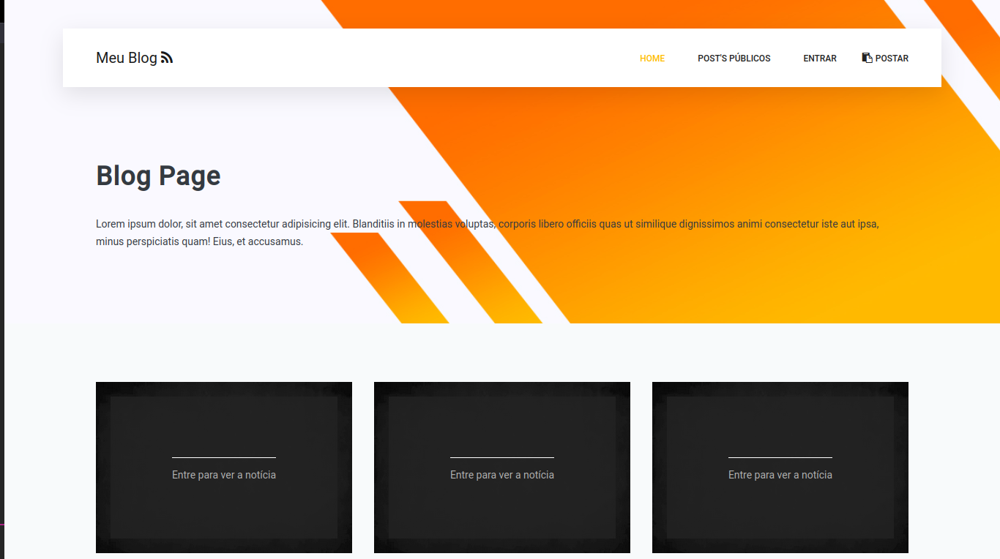
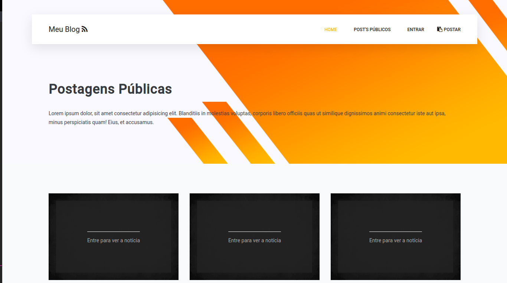
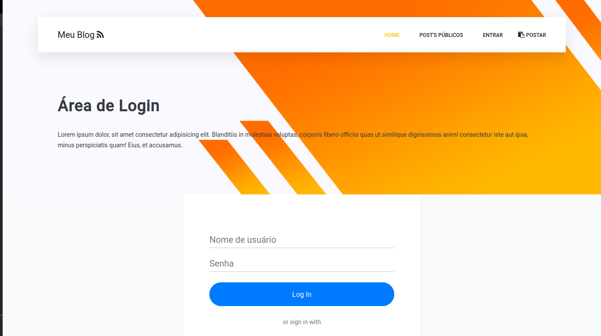

# Meu Blog 

Meu blog é uma aplicação que permite visualizer postagens. A finalidade do projeto é poder construir uma aplicação onde pudesse colocar em práticas todos os conceitos Node.js, criando autenticação e login por meio do facebook e google.

## Imagens do Projeto

